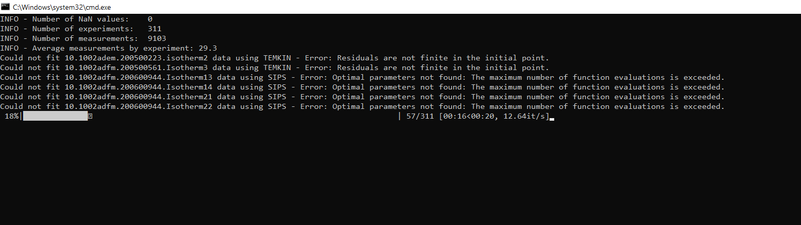

# ADSORFIT: Automated Adsorption Model Fitting

## 1. Project Overview
ADSORFIT is designed to streamline the process of adsorption modeling for researchers in the field. By automating the fitting of theoretical adsorption models to empirical isotherm data, this tool helps in accurately extracting crucial adsorption parameters such as adsorption constants and saturation uptakes. The core functionality revolves around minimizing the Least Squares Sum (LSS) discrepancy between observed and model-predicted uptakes, thereby refining the fit and ensuring the model constants reflect true adsorption behavior under given experimental conditions.

## 2. Installation 
The installation process on Windows has been designed for simplicity and ease of use. To begin, simply run `ADSORFIT.bat`. On its first execution, the installation procedure will automatically start with minimal user input required. The script will check if either Anaconda or Miniconda is installed on your system. If neither is found, you will need to install it manually. You can download and install Miniconda by following the instructions here: (https://docs.anaconda.com/miniconda/).

After setting up Anaconda/Miniconda, the installation script will install all the necessary Python dependencies. If you'd prefer to handle the installation process separately, you can run the standalone installer by executing `setup/ADSORFIT_installer.bat`. You can also use a custom python environment by modifying `settings/launcher_configurations.ini` and setting use_custom_environment as true, while specifying the name of your custom environment.

**Important:** After installation, if the project folder is moved or its path is changed, the application will no longer function correctly. To fix this, you can either:

- Open the main menu, select "ADSORFIT setup," and choose "Install project packages"
- Manually run the following commands in the terminal, ensuring the project folder is set as the current working directory (CWD):

    `conda activate ADSORFIT`

    `pip install -e . --use-pep517` 

## 3. How to use
On Windows, run `ADSORFIT.bat` to launch the main navigation menu and browse through the various options. Alternatively, you can launch the main app file running `python ADSORFIT/fitting/adsorption_models_fitting.py`.

### 3.1 Navigation menu

**1) Run ADSORFIT:** run the main application and start ADSORFIT, running the selected model through the solver to fit available adsorption data. Here is an example of the console output during the fitting process:

**2) ADSORFIT setup:** allows running some options command such as **install project into environment** to run the developer model project installation, and **remove logs** to remove all logs saved in `resources/logs`. 

**3) Exit and close**

### 3.2 Resources
This is the folder where both the source data and the results are located. The adsorption data to be fitted must be provided as a csv file with name `resources/adsorption_data.csv`. If the option to automatically detect columns is selected, ADSORFIT will identify target columns based on string pattern matching (anything resembling these keywords will identify the corresponding column):

- `experiment:` column containing the ID or name of the experiment used to group multiple measurements within the same experiment
- `temperature:` holds the temperature of the adsorption isotherm, measured in Kelvin
- `pressure:` contains the pressure points of the adsorption isotherm, measured in Pascal
- `uptake` includes the uptake measurements of the adsorption isotherm, expressed in mol/g

If automatico column name detection is off, the columns `experiment`, `temperature [K]`, `pressure [Pa]` and `uptake [mol/g]` must be present and should contain the correct data.

- **best fit:** collects the best fitting results obtained from different models

- **logs:** the application logs are saved within this folder

### 4. Configurations
For customization, you can modify the main configuration parameters using `settings/app_configurations.json` 

#### Model configuration  
Each model can be configured using the following settings, where you can set an initial, minimun and maximum value for all parameters.

| Setting          | Description                                                     |
|------------------|-----------------------------------------------------------------|
| MODEL_INITIAL    | Initial guess values for Langmuir adsorption model parameters   |
| MODEL_MIN        | Minimun value of Langmuir adsorption model parameters           |
| MODEL_MAX        | Maximum value of Langmuir adsorption model parameters           |

#### Solver configuration

| Parameter          | Description                                                   |
|--------------------|---------------------------------------------------------------|
| DETECT_COLUMNS     | Automatically detect target columns based on pattenr matching |
| MAX_ITERATIONS     | Max number of fitting iterations                              |
| SELECTED_MODELS    | Currently selected model for fitting                          |

## 5. License
This project is licensed under the terms of the MIT license. See the LICENSE file for details.

