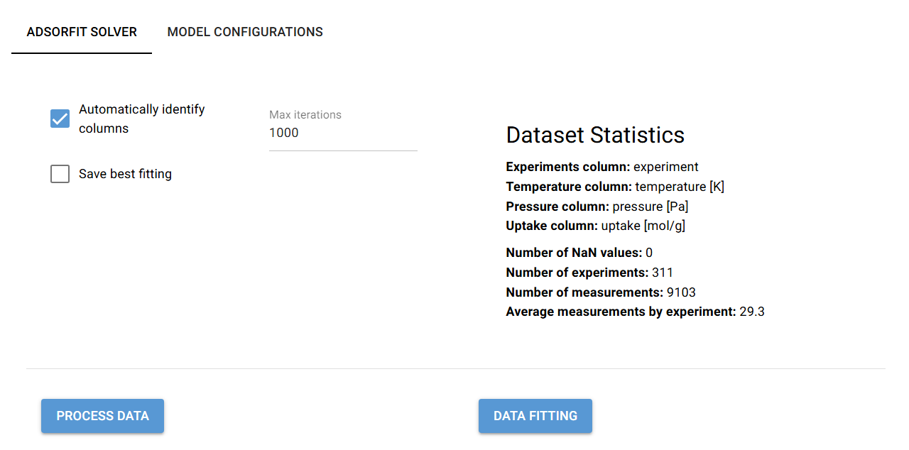
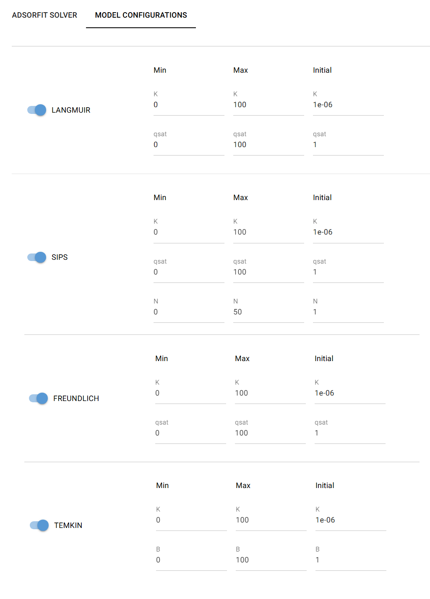

# ADSORFIT: Automated Adsorption Model Fitting

## 1. Project Overview
ADSORFIT is a powerful yet simple tool designed to facilitate adsorption modeling for researchers. It automates experimental data fitting using theoretical adsorption models, enabling accurate extraction of adsorption constants and saturation uptakes from your adsorption isotherms. The core functionality revolves around minimizing the Least Squares Sum (LSS) discrepancy between observed data and model-predicted uptakes. This ensures that the derived model parameters reliably represent the true adsorption behavior under the given experimental conditions. To make things even easier, ADSORFIT features an intuitive, user-friendly interface built with NiceGUI, making it accessible to users of all experience levels.

## 2. Installation 
The installation process on Windows has been designed to be fully automated. To begin, simply run *start_on_windows.bat.* On its first execution, the installation procedure will execute with minimal user input required. The script will check if either Anaconda or Miniconda is installed and can be accessed from your system path. If neither is found, it will automatically download and install the latest Miniconda release from https://docs.anaconda.com/miniconda/. Following this step, the script will proceed with the installation of all necessary Python dependencies. Should you prefer to handle the installation process separately, you can run the standalone installer by running *setup/install_on_windows.bat*.  

**Important:** After installation, if the project folder is moved or its path is changed, the application will no longer function correctly. To fix this, you can either:

- Open the main menu, select *Setup and maintentance* and choose *Install project in editable mode*
- Manually run the following commands in the terminal, ensuring the project folder is set as the current working directory (CWD):

    `conda activate ADSORFIT`

    `pip install -e . --use-pep517` 

## 3. How to use
On Windows, run *start_on_windows.bat* to launch the main navigation menu and browse through the various options. Please note that some antivirus software, such as Avast, may flag or quarantine python.exe when called by the .bat file. If you encounter unusual behavior, consider adding an exception for your Anaconda or Miniconda environments in your antivirus settings.

### 3.1 Navigation menu

**1) Run ADSORFIT UI:** Launch ADSORFIT to access the main user interface, which is organized into two distinct tabs. The first tab allows users to perform essential computational tasks, such as fitting adsorption models to isotherm data and preprocessing datasets. The second tab provides an intuitive interface for reviewing and adjusting critical adsorption model parameters. Users can specify the maximum number of iterations for data fitting and choose whether to automatically infer columns content based on their header. Additionally, it is possible to save multiple CSV files, each of them reporting the best results for a given model. 

**2) Setup and Maintenance:** execute optional commands such as *Install project into environment* to reinstall the project within your environment, *update project* to pull the last updates from github, and *remove logs* to remove all logs saved in *resources/logs*. 

**3) Exit:** close the program immediately 

### 3.2 Resources
This is where you can find the source adsorption data and the fitting results. The experimental adsorption isotherm data should be loaded in this folder as a CSV file named *adsorption_data.csv*. If automatic column name detection is disabled, the file must include the following columns with these exact names and units: *experiment*, *temperature [K]*, *pressure [Pa]*, and *uptake [mol/g]*. On the other hand, if the option to automatically detect columns is selected, ADSORFIT will identify target columns based on keywords and string pattern matching.

A template of the expected CSV format is available at *resources/templates/adsorption_data.csv*. 

- **best fit:** collects the best fitting results obtained from different models, if the option is selected during data fitting.

- **logs:** log files are saved here

- **templates:** reference template files can be found here

### 4. Configurations
Each adsorption model can be configured in the **Model Configuration** tab where you can set an initial guess value for the adsorption model parameters,as well as boundaries for the minimun and maximum expected values.

**Environmental variables** are stored in *setup/variables/.env*. For security reasons, this file is typically not uploaded to GitHub. Instead, you must create this file manually by copying the template from *resources/templates/.env* and placing it in the *setup/variables* directory.

| Variable              | Description                                              |
|-----------------------|----------------------------------------------------------|
| NICEGUI_PORT          | Port to run NiceGUI application  (default is 8080)       |
| NICEGUI_HOST          | Host address for the NiceGUI server                      |

## 5. License
This project is licensed under the terms of the MIT license. See the LICENSE file for details.

